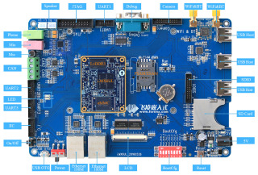

# Forlinx OKMX6UL-C1 Base Board

([Full size](../Assets/Images/OKMX6UL-C1.jpg))

## Introduction

[Forlinx Embedded](http://www.forlinx.net/) - the company producing the [SOM](SOM.md) - has a complete single board computer which should be capable of using the same CPU board as the NOVA Pro, while providing a wide selection of I/O as well as dip switches for various settings (boot options etc.).

## Additional information

* [Forlinx product page](http://www.forlinx.net/product/i.mx6ul-39.html)
* [IoTBits information page](http://iot-bits.com/the-forlinx-mx6ul-development-board/)
* [HackerBoard.com page](https://hackerboards.com/boards/okmx6ul-c1-sbc/)
* [eLinux](https://elinux.org/Development_Platforms) - list of development platforms for embedded Linux (includes the OKMX6UL)
* [Alibaba.com product page](https://www.alibaba.com/product-detail/Cost-Effective-Cortex-A7-I-MX6_60628012707.html) - primary retail point (~€60/unit)
