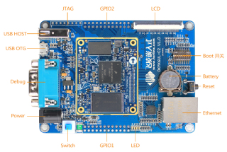

# Forlinx OKMX6UL-C2 Base Board

([Full size](../Assets/Images/OKMX6UL-C2.jpg))

## Introduction

[Forlinx Embedded](http://www.forlinx.net/) - the company producing the [SOM](SOM.md) - has a complete single board computer which should be capable of using the same CPU board as the NOVA Pro, while providing a reasonable selection of I/O as well as dip switches for various settings (boot options etc.).

## Additional information

* [Forlinx product page](http://www.forlinx.net/product/i.mx6ul-41.html)
* [Alibaba.com product page](https://www.alibaba.com/product-detail/Low-Cost-Linux-Single-Board-Computer_60622797375.html) - primary retail point (~€50/unit)

