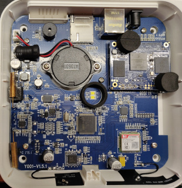
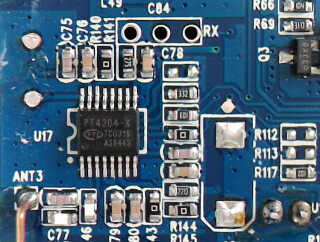

# Y001 Base Board 

Full revision printed on board: **Y001-V1.5.1**


([Full size](../Assets/Images/y001-inside.jpg))


## RF Radio

A [Princeton Technology Corp PT4304-X](http://www.princeton.com.tw/Portals/0/PT4304-s.pdf) OOK/ASK receiver for the 315/433.92 MHz frequency bands is mounted on U17 and is responsible for handling RF radio. Using an oscilloscope on the nearby 3 pin header will show radio trafic on the 433 MHz band. It uses ANT3 for receiving.

TODO: Transmission uses ANT4


([Full size](../Assets/Images/y001-u17-pt4304.jpg))


## RF Decoder?

An [STM32 F103VC](https://www.st.com/en/microcontrollers-microprocessors/stm32f103.html) processor with 48 KiB RAM and 256 KiB NVRAM and is mounted on U16. It may be used for RF signal decoding/processing, but we are unsure at this point.


([Full size](../Assets/Images/y001-u16-stm32.jpg))

If enabled by raiding [GPIO 8](BaseBoard.md#gpios), it will show up in `lsusb`:

```
Bus 001 Device 005: ID 0483:5740 SGS Thomson Microelectronics 
```


## Mystery Header U19

At this time, it is unknown exactly what U19 was meant for. We're hoping for an SD-Card adapter :-)


([Full size](../Assets/Images/y001-u19.jpg))


## USB2 Controller

Next to the Mystery Header (U19), an [SMSC USB2514B](https://pdf1.alldatasheet.com/datasheet-pdf/view/312091/SMSC/USB2514B.html) USB2 controller package is mounted on U13. These may be related.


([Full size](../Assets/Images/y001-u13-usb2514b.jpg))
