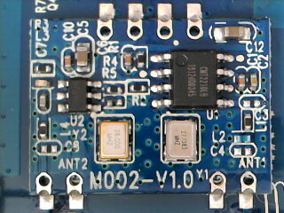
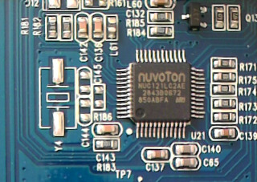
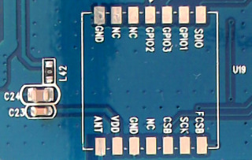

# Y005 Base Board

Full revision printed on board: **Y005-F4**

([Full size](../Assets/Images/y005-inside.jpg))

## RF Radio

A module called MOO2-V1.0 appears to handle RF radio on the Y005. It features a [CMOSTEK CMT2210LB](https://www.hoperf.com/ic/rf_receiver/CMT2210LBW.html) on U1 for receiving through ANT3 (ANT1 on the MOO2 module) and possibly a transmitter at U2 transmitting through ANT4 (ANT2 on the MOO2 module).

([Full size](../Assets/Images/y005-moo2.jpg))

## RF Decoder?

A [Nuvoton NUC121LC2AE](https://www.nuvoton.com/products/microcontrollers/arm-cortex-m0-mcus/nuc121-125-series/nuc121lc2ae/) is mounted at U21. It's an ARM Cortex®-M0 32-bit Microcontroller running up to 50 MHz and supporting 32 KiB Flash, 8 KiB SRAM. It may be used for RF signal processing, but we are unsure at this point.

([Full size](../Assets/Images/y001-u16-stm32.jpg))

## Mystery Header U19

Like the Y001, the Y005 also has an unused mystery header at U19. We're still hoping for an SD-Card adapter :-)

([Full size](../Assets/Images/y005-u19.jpg))

The NUC121 is located close to U19 at U21 and features USB connectivity, same as the USB2 controller on Y001.
