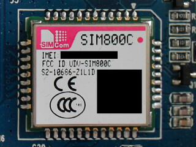

# Base Board

## Introduction

This board has all the I/O peripherals needed to communicate with sensors, network (either through wifi or Ethernet), GSM network as well as a siren and a smaller beeper. The board also receives power from an external power supply and charges the battery. It also holds the [SOM](SOM.md).

For development, see the [Forlinx OKMX6UL-C1 Base Board](BaseBoard-OKMX6UL-C1.md) or the [Forlinx OKMX6UL-C2 Base Board](BaseBoard-OKMX6UL-C2.md)

## Versions

At least two different versions of the unit exists. We will try to keep the common parts here, and separate the differences in version specific pages.

### Quick Comparison

| &nbsp;      | [Y001](BaseBoard-Y001.md)                | [Y005](BaseBoard-Y005.md)    |
| ----------- | ---------------------------------------- | ---------------------------- |
| GSM         | SIM800C                                  | SIM800C                      |
| WLAN        | Realtek RTL8723BU                        | Realtek RTL8723BU            |
| RF Radio    | Princeton Technology PT4304-X (Receiver) | CMOSTEK CMT2210LB (Receiver) |
| RF Decoder? | STM32F103VC                              | Nuvoton NUC121LC2AE          |


## GSM Connectivity

A [SIM800C](https://www.simcom.com/product/SIM800C.html) package is mounted on U5, providing GSM connectivity through ANT1. Needs to be enabled by setting [GPIO 128](#gpios)?


([Full size](../Assets/Images/y001-u5-sim800c.jpg))


## WLAN Connectivity

A [Realtek RTL8723BU](https://www.realtek.com/en/products/communications-network-ics/item/rtl8723bu) package is mounted on U12, providing WLAN connectivity through ANT2. Needs to be enabled by lowering [GPIO 132](#gpios).


([Full size](../Assets/Images/y001-u12-rtl8723bu.jpg))


#### GPIOs

This information is recovered from `/data/scripts/start/gpio_init.sh`. Values marked *default* are the values explicitly set by the script, not the boot time defaults:

| GPIO | Direction | Description        | Notes                        |
| ---- | --------- | ------------------ | ---------------------------- |
| 1    | out       | Red LED            | 0: (default)                 |
| 2    | out       | Blue LED           | 1: (default)                 |
| 3    | out       | Green LED          | 1: (default)                 |
| 4    | out       | GSM DTR            |
| 8    | out       | STM32 enabled      | 0: no <br/> 1: yes (default) | Power-cycled on startup. Only on Y001?  |
| 9    | in        | Reset button       |
| 128  | out       | GSM enable         | 0: (default)                 |
| 129  | in        | GSM discovery(?)   |
| 130  | out       | mic                | 1: (default)                 |
| 132  | out       | WLAN enabled       | 0: yes (default) <br/> 1: no | Enables or disabled the RTL 8723BU WLAN |
| 135  | in        | Wifi button(?)     |
| 136  | out       | Intercom switch(?) | 1: (default)                 |
| 137  | in        | SIM card inserted  |

Define and get an input GPIO like this:

```
echo 9  > /sys/class/gpio/export
echo in > /sys/class/gpio/gpio9/direction
cat       /sys/class/gpio/gpio9/value
```

Define and set an output GPIO like this:

```
echo 1   > /sys/class/gpio/export
echo out > /sys/class/gpio/gpio1/direction
echo 0   > /sys/class/gpio/gpio1/value
```
