# I/O Board

## Introduction

This board has all the I/O peripherals needed to communicate with sensors, network (either through wifi or Ethernet), GSM network as well as a siren and a smaller beeper. The I/O board also receives power from an external power supply and holds the battery.

## Versions

### Quick Overview

| &nbsp;      | Y001                                     | Y005                         |
| ----------- | ---------------------------------------- | ---------------------------- |
| GSM         | SIM800C                                  | SIM800C                      |
| WLAN        | Realtek RTL8723BU                        | Realtek RTL8723BU            |
| RF Radio    | Princeton Technology PT4304-X (Receiver) | CMOSTEK CMT2210LB (Receiver) |
| RF Decoder? | STM32F103VC                              | Nuvoton NUC121LC2AE          |

### Y001

Full revision printed on board: **Y001-V1.5.1**

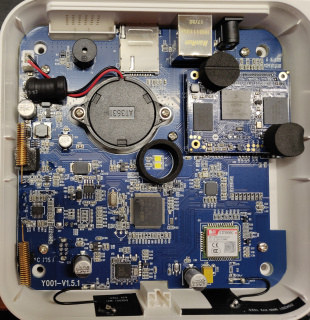
([Full size](../Assets/Images/y001-inside.jpg))

#### GSM Connectivity

A [SIM800C](https://www.simcom.com/product/SIM800C.html) package is mounted on U5, providing GSM connectivity through ANT1.

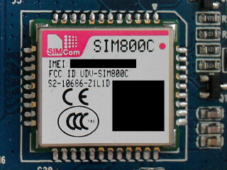
([Full size](../Assets/Images/y001-u5-sim800c.jpg))

#### WLAN Connectivity

A [Realtek RTL8723BU](https://www.realtek.com/en/products/communications-network-ics/item/rtl8723bu) package is mounted on U12, providing WLAN connectivity through ANT2.

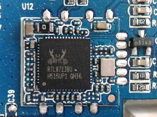
([Full size](../Assets/Images/y001-u12-rtl8723bu.jpg))

#### RF Radio

A [Princeton Technology Corp PT4304-X](http://www.princeton.com.tw/Portals/0/PT4304-s.pdf) OOK/ASK receiver for the 315/433.92 MHz frequency bands is mounted on U17 and is responsible for handling RF radio. Using an oscilloscope on the nearby 3 pin header will show radio trafic on the 433 MHz band. It uses ANT3 for receiving.

TODO: Transmission uses ANT4

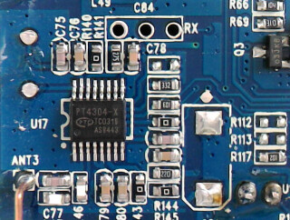
([Full size](../Assets/Images/y001-u17-pt4304.jpg))

#### RF Decoder?

An [STM32 F103VC](https://www.st.com/en/microcontrollers-microprocessors/stm32f103.html) processor with 48 KiB RAM and 256 KiB NVRAM and is mounted on U16. It may be used for RF signal decoding/processing, but we are unsure at this point.

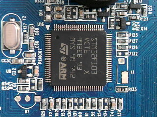
([Full size](../Assets/Images/y001-u16-stm32.jpg))

#### Mystery Header U19

At this time, it is unknown exactly what U19 was meant for. We're hoping for an SD-Card adapter :-)

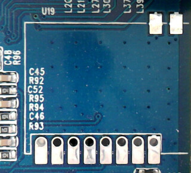
([Full size](../Assets/Images/y001-u19.jpg))

#### USB2 Controller

Next to the Mystery Header (U19), an [SMSC USB2514B](https://pdf1.alldatasheet.com/datasheet-pdf/view/312091/SMSC/USB2514B.html) USB2 controller package is mounted on U13. These may be related.

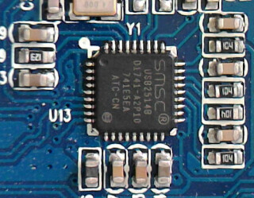
([Full size](../Assets/Images/y001-u13-usb2514b.jpg))

#### GPIO

TODO

### Y005

Full revision printed on board: **Y005-F4**

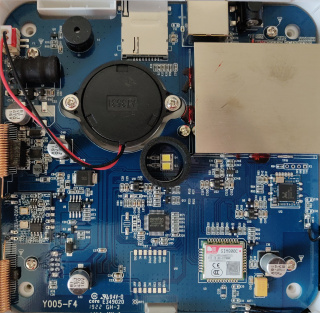
([Full size](../Assets/Images/y005-inside.jpg))

#### GSM Connectivity

A [SIM800C](https://www.simcom.com/product/SIM800C.html) package is mounted on U5, providing GSM connectivity through ANT1.

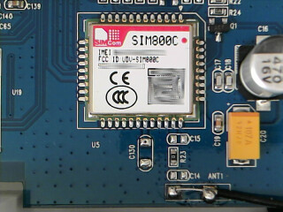
([Full size](../Assets/Images/y005-u5-sim800c.jpg))

#### WLAN Connectivity

A [Realtek RTL8723BU](https://www.realtek.com/en/products/communications-network-ics/item/rtl8723bu) package is mounted on U12, providing WLAN connectivity through ANT2.

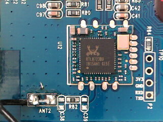
([Full size](../Assets/Images/y005-u12-rtl8723bu.jpg))

#### RF Radio

A module called MOO2-V1.0 appears to handle RF radio on the Y005. It features a [CMOSTEK CMT2210LB](https://www.hoperf.com/ic/rf_receiver/CMT2210LBW.html) on U1 for receiving through ANT3 (ANT1 on the MOO2 module) and possibly a transmitter at U2 transmitting through ANT4 (ANT2 on the MOO2 module).

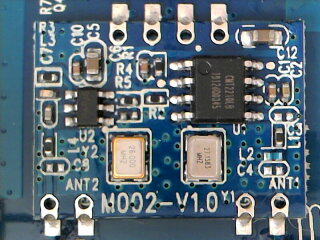
([Full size](../Assets/Images/y005-moo2.jpg))

#### RF Decoder?

A [Nuvoton NUC121LC2AE](https://www.nuvoton.com/products/microcontrollers/arm-cortex-m0-mcus/nuc121-125-series/nuc121lc2ae/) is mounted at U21. It's an ARM Cortex®-M0 32-bit Microcontroller running up to 50 MHz and supporting 32 KiB Flash, 8 KiB SRAM. It may be used for RF signal processing, but we are unsure at this point.

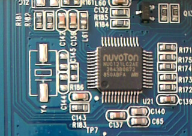
([Full size](../Assets/Images/y001-u16-stm32.jpg))

#### Mystery Header U19

Like the Y001, the Y005 also has an unused mystery header at U19. We're still hoping for an SD-Card adapter :-)

([Full size](../Assets/Images/y005-u19.jpg))

The NUC121 is located close to U19 at U21 and features USB connectivity, same as the USB2 controller on Y001.

#### GPIO

TODO
