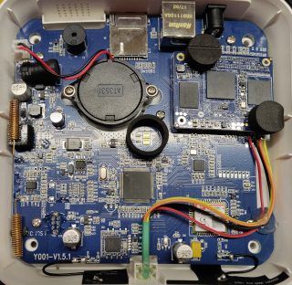
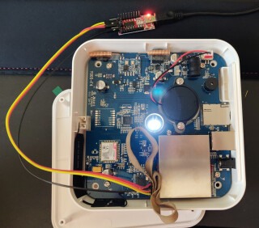

# U-Boot

The device uses [U-Boot](https://en.wikipedia.org/wiki/Das_U-Boot) to boot the operating system. You will need to access the boot loader to boot the device in single user mode.

For information about the operating system, go [here](OS).

## Accessing the Console

Connect a 3.3V FTDI adapter (available on [AliExpress](https://www.aliexpress.com/wholesale?SearchText=FT232RL+FTDI) and [Banggood](https://www.banggood.com/search/ft232rl-ftdi.html) for next to nothing) to the console port on P2 on the device using test wires. The power from the FTDI adapter doesn't seem to be enough to drive the SOM and base board - using the battery as a power source is the safest, but you can also connect the power supply IF you disconnect the 3.3V power wire from from the FTDI adapter.

Running with 3.3V from the FTDI adapter AND the mains power supply can make the charger give off a slightly disturbing humming sound and is not advised.

The connection is 115200N81 without hardware flow control. If connected correctly, you should see something like this when powering the unit on:

```
U-Boot 2016.03-21152-ga57b13b942-dirty (Aug 14 2018 - 11:25:39 +0800)

CPU:   Freescale i.MX6ULL rev1.1 528 MHz (running at 396 MHz)
CPU:   Industrial temperature grade (-40C to 105C) at 41C
Reset cause: POR
Board: MX6ULL 14x14 EVK
I2C:   ready
DRAM:  256 MiB
MMC:   FSL_SDHC: 0, FSL_SDHC: 1
*** Warning - bad CRC, using default environment

In:    serial
Out:   serial
Err:   serial
switch to partitions #0, OK
mmc1(part 0) is current device
Net:   FEC0
Error: FEC0 address not set.

Normal Boot
Hit any key to stop autoboot:  3
```

If you're unable to interrupt the boot sequence, you probably forgot to disable hardware flow control.


### Console access on Y001

No pin header holes - you will have to solder wires to the pads.


([Full size](../Assets/Images/y001-console.jpg))


### Console access on Y005

Pin header holes - solder a header on, or keep one in place with a rubber band.


([Full size](../Assets/Images/y005-console.jpg))


## Information

TODO


## U-Boot Usage

Here are a few examples for using the boot loader:


### Setting a fixed Ethernet hardware address

```
setenv ethaddr ca:fe:ba:be:12:34
saveenv
```


### Bypass init system and start shell

```
setenv mmcroot /dev/mmcblk1p2 rootwait rw init=/bin/bash
boot
```


### Extracting data

TODO


### Net Booting

It is possible to NFS mount the operating system. For details on this, see [Net Booting](Modifications/Netbooting.md) under [Modifications](Modifications/).


## Magic SysRq

Once booted, the this Linux kernel has [Magic SysRq](https://en.wikipedia.org/wiki/Magic_SysRq_key) enabled on the console. You can use this for various things, like rebooting the device without having to power it off.

To issue a SysRq command, first send a [serial break](https://en.wikipedia.org/wiki/Universal_asynchronous_receiver-transmitter#Break_condition) (`CTRL-A` `F` in Minicom), followed by a SysRq command, i.e. `b` for forcing an immediate reboot (not recommended). The proper SysRq command sequence for safely rebooting the device is `u` for mounting all filesystems read-only, `s` for flushing buffers and syncing filesystems and finally `b` for rebooting.


## Misc

* https://wiki.dh-electronics.com/index.php/COM_iMX6_Bootloader_U-Boot - Different device, but has lots of interesting information, including how to unbrick.
* https://www.youtube.com/watch?v=TX3Ppe26emY - Video on booting Freescale i.MX6. Interesting bit about loading the kernel over Kermit.
