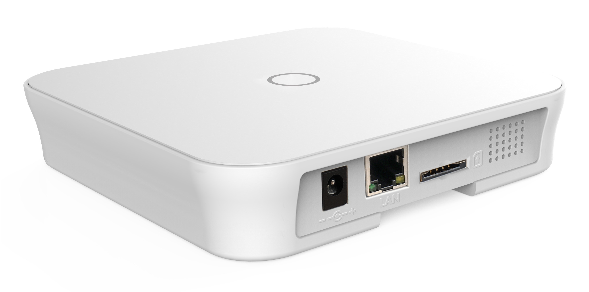

# Inside the NOVA Pro Alarm System

## Introduction

This repository contains information about the [Nova Pro Alarm System](https://www.dinsafer.com/product/nova-pro-smart-alarm-system-home-security/) designed and built by Shenzhen, China based [DinsafeR](https://www.dinsafer.com/). This repository is the work of volunteers and is not related to DinsafeR or their local partners, nor is DinsafeR or their local partners in any way responsible for this repository. The information found here may void the warrenty of your device, or render is useless. **Consider yourself warned.**

## Motivation

This is a nice, reasonably prices home alarm system - but we believe it's capable of much more. It is in fact a fully fledged Linux server with a bunch of really cool I/O peripherals and an integrated UPS. Think *Raspberry Pi with an 433 MHz radio hat, a GSM module hat, a siren and a battery*. All in one neat package.

Uncovering the mysteries of the NOVA is part curiousity, part optimistic dream about improving it. We realize that this device is already working fine for most people, but some of us enjoy tinkering with home automation and this system if falling way behind on that front.

Also, the alarm system is - at last in Denmark - being promoted as a self hosted, stand alone system without any dependencies. Even the SIM card is optional. While this sounds awesome, they neglect to tell you that the device has a hard dependency on DinsafeR's API servers. We would like to be able to opt out of that. Eventually.

## Branding

DinsafeR is the OEM, but the product range is branded, sold and supported by local partners:

| Country        | Brand                                                                                                                | Notes |
| -------------- | -------------------------------------------------------------------------------------------------------------------- | ----- |
| DK/NO/SE       | [SikkertHjem S6Evo](https://www.sikkerthjem.dk/)                                                                     |
| ES             | [Alarma SIN coutas Domótica TA-1](https://www.tualarmasincuotas.es/alarma-sin-cuotas-domotica-ta1-wifi-lan-gsm.html) |
| CZ/SK/HU/PL/SK | [iGET Security M4](http://www.iget.eu/cs/security-m4)                                                                |

## Hardware

The system is based around the i.MX6UL SoM by Chinese company Forlinx. We refer to that as the [CPU Board](Documentation/Hardware/CPU-Board.md). It features a Arm® Cortex®-A7 processor as well as RAM and NVRAM. The CPU Board is mounted on another board, which we call the [I/O Board](Documentation/Hardware/IO-Board.md). This board has all the I/O peripherals needed to communicate with sensors, network (either through wifi or Ethernet), GSM network as well as a siren and a smaller beeper. The I/O board also receives power from an external power supply and holds the battery.

Read more about the hardware [here](Documentation/Hardware/).

## Software

The system is based on open source software. It is running a Debian based GNU/Linux operating system. The version (7.0) on the device is outdated and not supported any more. The references package repositories are not available any more, currently making it impossible to update or install additional packages.

The applications running the actual alarm system are written in [Go](https://golang.org/). Go is a language that compiles directly to binary code and doesn't need a virtual machine or script interpreter to run. Library dependencies are statically linked and included in the binary, making it perfect for embedded systems like the NOVA.

Read more about the software [here](Documentation/Software/).

## Contributing

At time of writing (July 2020), this is a one man effort, so your help would be much appreciated. Feel free to clone this repository and make a pull request with your contributions. Take a look at the [TODO list](TODO.md) for inspiration. If you want to say hi, there is a [Facebook group](https://www.facebook.com/groups/s6evo.inside/).
